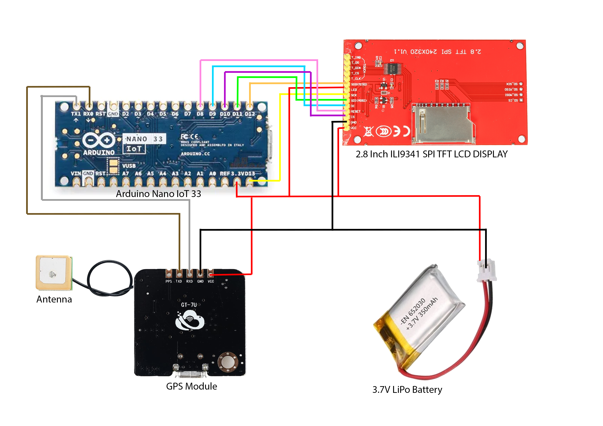

# **Watch Your Wearables** #

### **Project Context**

Watch Your Wearables is an experimental project designed to bring awareness to the risks associated with wearable technology. 56% of people own a wearable device (Clark, 2019), however many are just quick to jump onto a trend and do not realise the power behind them. With wearable devices being so up-close and personal to our bodies, safety should be a number one priority, however these devices are also vulnerable to online hackers who are targeting personal data from you, such as contact information or location data.

### **Project Information**

Watch Your Wearable utilises an Arduino Nano IoT 33 board, a TFT LCD display and a GPS module to create an invasive and disruptive wearable. Disguised in the form of a digital lanyard, the device poses as a nametag, however the device is actually public domain with anybody being able to access it.

People may use the website connected to the device to customise the display of the TFT LCD and also send their own messages to be seen by everybody surrounding the clueless 'victim'. Users may choose how they decide to interact with the device, whether it be paying the wearer a compliment or tormenting them by utilising the GPS data to make them believe they're being followed.

### **The Technology**

**Arduino Components**
- Arduino Nano IoT 33
- 3.7v lipo battery
- GPS module and antenna
- 2.8 Inch ILI9341 SPI TFT LCD Display

**Arduino Libraries**
- SPI
- Wifi Nina
- TinyGPS
- MQTT
- Adafruit GFX
- Adafruit ILI9341

**Website Technologies**
- MQTT Protocols
- Node.js
- handlebars.js
- express
- socket.io

### **Setup**

**Website**
1. Download [Github Repo](https://github.com/EmmaStolly/watchyourwearable)
2. Open command prompt and cd to the directory
3. Input MQTT topic, location and address into app.js
4. Run npm i
5. Run node app
6. Application loads into localhost:3000

**Arduino**

_See 'Arduino Components' for equipment list_

1. Wire components together following the diagram below:

2. Download [Github Repo](https://github.com/EmmaStolly/watchyourwearable) and locate Arduino_Control/Arduino_Control.ino

3. Input MQTT user and password

4. Input wifi ssid and password (Mobile hotspot is good for out and about)

5. Using a mini-USB cable, plug in Arduino Nano IoT 33 to computer

6. Upload code to Arduino Nano IoT 33

7. Open serial monitor and wait for connection to wifi and MQTT

8. Unplug and you're good to go!

### Live Application Demo

https://watchyourwearables.herokuapp.com/

**Bibliography**

Clark, E. (2019) '3 Ways Google Can Compete With Apple in the Wearables Market', The Manifest, 14 November. Available at: https://themanifest.com/app-development/3-ways-google-compete-apple-wearables-market.
